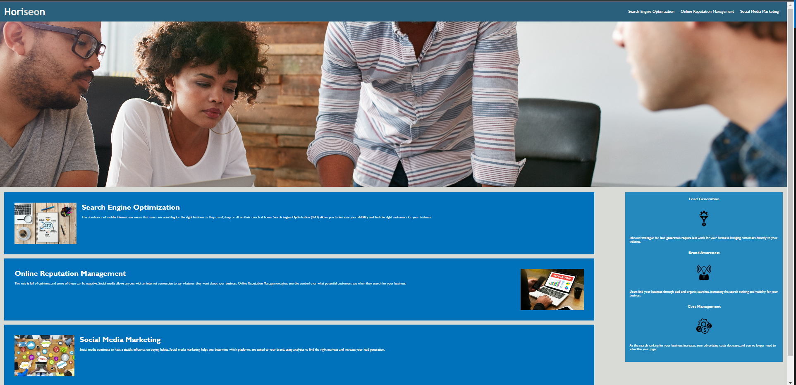

# 01-horiseon-accesibilty
Accessibility for horiseon

## Description

This webpage is our bootcamp's first assignment at Northwesterns Bootcamp. The assignment is to practice both optimizing your HTML and CSS code base, as well as making ALL projects accesbile. Here we added alt text as a practice measure.

- What was your motivation?
- Why did you build this project? (Note: the answer is not "Because it was a homework assignment.")
- What problem does it solve?
- What did you learn?

## Table of Contents (Optional)

If your README is long, add a table of contents to make it easy for users to find what they need.

- [Installation](#installation)
- [Usage](#usage)
- [Credits](#credits)
- [License](#license)

## Installation

N/A

## Usage

This is a webpage for the group, Horiseon Social Solution Services, Inc.. The page describes the teams ability to successfully navigate digital marketing channels while optimizing your social media.

## Credits

Bryan LeBeuf & Ian Wolfe

## License

N/A

## Badges

N/A

## Features

The webpage covers the three paradigms of social media success and their ability to leverage said paradigms: Lead Generation, Brand Awareness and Cost Management.

## How to Contribute

If you created an application or package and would like other developers to contribute it, you can include guidelines for how to do so. The [Contributor Covenant](https://www.contributor-covenant.org/) is an industry standard, but you can always write your own if you'd prefer.

## Tests

Go the extra mile and write tests for your application. Then provide examples on how to run them here.